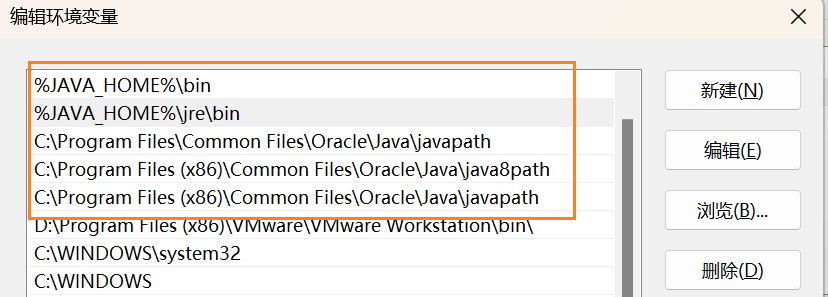

# JEnv for PowerShell

Windows 下没有太好用的 java 版本管理工具，如果用[bat 脚本](https://github.com/FelixSelter/JEnv-for-Windows)，遇到的一个问题是 bat 脚本执行后会自动退出，部分工具的脚本如果执行了 java 命令会导致后续的内容无法执行（因为实际执行的是 `java.bat`，手动修改成`call xxx.bat`也比较麻烦）

## Install

下载压缩包后初始化 jenv

```powershell
./jenv -init 1
```

## Usage

| 功能     | 作用                       | 命令                         |
| -------- | -------------------------- | ---------------------------- |
| Init     | 初始化                     | `jenv -init 1`               |
| Add      | 添加 JDK 路径              | `jenv -add /path/to/jdk-xxx` |
| Global   | 设置默认 JDK 版本          | `jenv -global jdk-xxx`       |
| Shell    | 设置当前 shell 的 JDK 版本 | `jenv -shell jdk-xxx`        |
| Remove   | 删除 JDK 版本              | `jenv -remove jdk-xxx`       |
| Versions | 查看所有 JDK 版本          | `jenv -versions 1`           |

PS：

- Add 重复 JDK 时，会更新旧字段
- Global 需要管理员权限，推荐手动将安装 java 时自动创建的`C:\Program Files\Common Files\Oracle\Java\javapath`、`java8path`移动到`%JAVA_HOME%\bin%`和`%JAVA_HOME%\jre\bin%`下面

  
